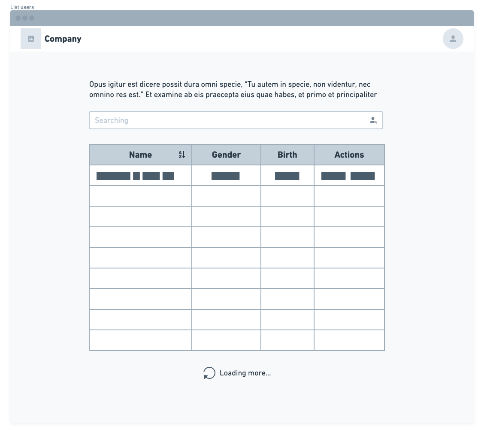

# Pharma Inc listagem de usuários

## Introdução

Este é um desafio para testar seus conhecimentos de Front-end;

O objetivo é avaliar a sua forma de estruturação e autonomia em decisões para construir algo escalável utilizando um framework moderno javascript.

Você está livre para usar React.js ou Vue.js ou Angular 8+ no desenvolvimento da solução deste tech challenge.

[SPOILER] As instruções de entrega e apresentação do challenge estão no final deste Readme (=

### Instruções iniciais obrigatórias

- Utilizar o seu github pessoal para publicar o desafio. Confirme que a visibilidade do projeto é pública (não esqueça de colocar no readme a referência a este challenge);

## Case

A empresa Pharma Inc, está trabalhando em um projeto em colaboração com sua base de clientes para facilitar a gestão e visualização da informação dos seus pacientes de maneira simples e objetiva em um Dashboard onde podem listar, filtrar e expandir os dados disponíveis.
O seu objetivo nesse projeto, é trabalhar no desenvolvimento do Front end que consumirá a API da empresa Pharma Inc seguindo os requisitos propostos neste desafio.

## Recursos

1. Estudar a documentação da REST API: https://randomuser.me/documentation
2. Utilizar React.js ou Vue.js ou Angular 8+ para construir a solução do Challenge;
3. Utilizar Frameworks CSS ou estilo proprio, recomendamos alguns como:

   - Tailwind CSS: https://tailwindcss.com/
   - Material UI: https://material-ui.com/
   - Angular Material: https://material.angular.io/
   - Bootstrap: https://getbootstrap.com/
   - Bulma: https://bulma.io/

4. Trabalhar em um repositório em seu usuário ou utilizar o seu github pessoal (não esqueça de colocar no readme a referência a este challenge);

## Lista de Pacientes

A tela inicial do projeto será um lista de pacientes que deverá conter um buscador para facilitar filtrar todos os que são exibidos na lista, proposta:



Para obter os dados, utilizaremos a API do Random User:

- https://randomuser.me/api/

Exemplo da resposta:

```json
{
  "results": [
    {
      "gender": "female",
      "name": {
        "title": "Ms",
        "first": "Alea",
        "last": "Christoffersen"
      }
    }
  ],
  "info": {
    "seed": "2f10116f1799d353",
    "results": 1,
    "page": 1,
    "version": "1.3"
  }
}
```

Além de realizar a request, devemos aplicar alguns filtros na API:

- O resultado da API deve ser armazenado em um estado global. (Pode ser utilizado Redux, Context, Vuex ou tecnologia equivalente do framework utilizado)
- Limitar cada requisição da página em 50 resultados para não sobrecarregar a API.
- Adicionar o parâmetro de paginação para controlar o `Loading more`

### Visualizar paciente

Na coluna de ações da tabela, existe o botão visualizar para expandir os dados dos pacientes. Seguir o modelo proposto:


Devemos exibir os seguintes campos do paciente:

- Imagem
- Nome completo
- Email
- Gênero
- Data de nascimento
- Telefone
- Nacionalidade
- Endereço
- ID (Número de identificação)
- URL para compartilhamento

### URL para compartilhar paciente

Ao acessar a aplicação diretamente por essa URL a aplicação deve abrir o modal com as informações do paciente.

- A URL deve conter o ID do paciente
- Abrir o modal com as informações do paciente ao acessar a aplicação por essa URL

## Extras

Além do desafio proposto com as duas telas, temos alguns diferenciais:

- **Diferencial 1** Adicionar um filtro por Gênero na tabela;
- **Diferencial 2** Configurar o buscador para poder filtrar por nome e nacionalidade;
- **Diferencial 3** Adicionar o paginador rota para facilitar compartilhar o link e manter a posição na lista;
- **Diferencial 4** Escrever Unit Tests ou E2E Test na Lista de Pacientes. Escolher a melhor abordagem e biblioteca;
- **Diferencial 5** Configurar Docker no Projeto para facilitar o Deploy da equipe de DevOps;

## Readme do Repositório

- Deve conter o título do projeto
- Uma descrição sobre o projeto em frase
- Deve conter uma lista com linguagem, framework e/ou tecnologias usadas
- Como instalar e usar o projeto (instruções)
- Não esqueça o [.gitignore](https://www.toptal.com/developers/gitignore)
- Se está usando github pessoal, referencie que é um challenge by coodesh
