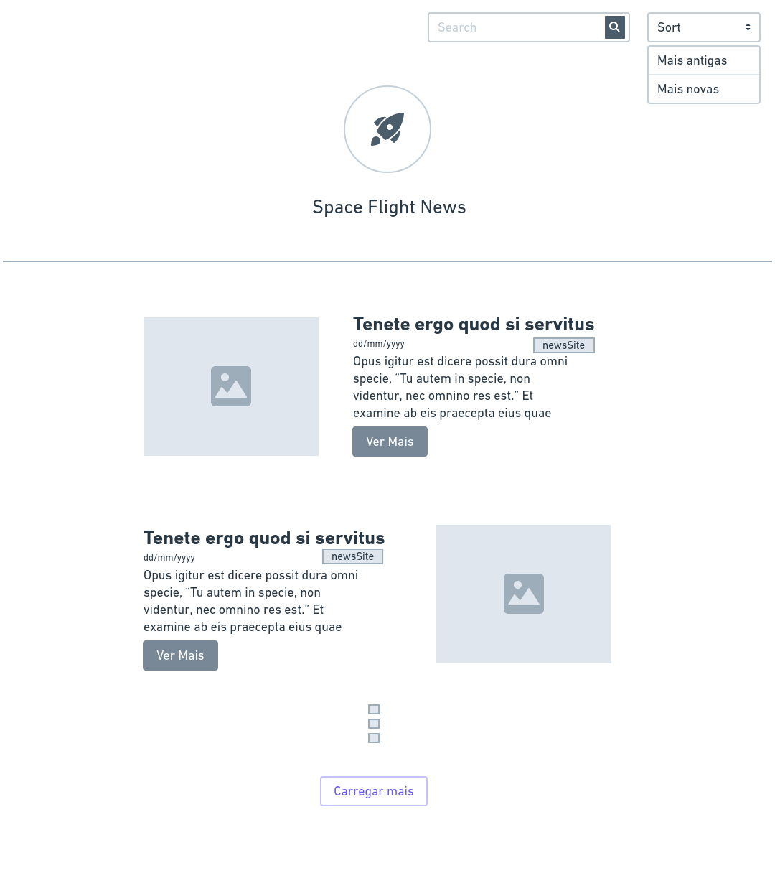
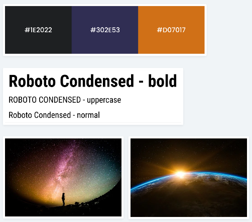

# Space Flight News - Site de noticias sobre espaço

## Introdução

Este é um desafio para que possamos ver as suas habilidades como Fullstack Developer.

Nesse desafio você deverá desenvolver uma REST API que utilizará os dados do projeto [Space Flight News](https://api.spaceflightnewsapi.net/v3/documentation), uma API pública com informações relacionadas a voos espaciais. Também deverá desenvolver um projeto front-end para consumir as informações da sua API.

O projeto a ser desenvolvido por você tem como objetivo exibir os dados dos artigos, com o título, imagem, resumo e data de publicação. Para isso você deve seguir o wireframe que você encontrará logo abaixo. Atente-se, ao desenvolver a aplicação front-end, para conceitos de usabilidade e adeque o wireframe com elementos visuais para os usuários do seu sistema.

[SPOILER] As instruções de entrega e apresentação do challenge estão no final deste Readme (=

### Instruções iniciais obrigatórias

- Trabalhar em um repositório em seu usuário ou utilizar o seu github pessoal (não esqueça de colocar no readme a referência a este challenge);
- O projeto **back-end** deverá ser desenvolvido com uma das tecnologias a seguir: **Node.js | C# .NET Core | PHP Laravel | RubyOnRails | Go Lang | Python FastAPI | SpringBoot Kotlin | Rust**;
- O projeto **front-end** deverá ser desenvolvido com uma das tecnologias a seguir: **React.js | Vue.js | Angular 8+**;
- Criar um banco de dados grátis **MongoDB** usando Atlas: https://www.mongodb.com/cloud/atlas ou banco de dados grátis **MySQL** no Heroku: https://elements.heroku.com/addons/jawsdb ou banco de dados grátis **Postgres** no Heroku: https://elements.heroku.com/addons/heroku-postgresql; (Recomendável usar Drivers oficiais para integração com o DB)

### Modelo de Dados:

Para a definição do modelo consulte a rota [GET]/articles da API, nesta rota você pode ver a estrutura como o exemplo:

```json
{
  "id": 0,
  "featured": false,
  "title": "string",
  "url": "string",
  "imageUrl": "string",
  "newsSite": "string",
  "summary": "string",
  "publishedAt": "string",
  "launches": [
    {
      "id": "string",
      "provider": "string"
    }
  ],
  "events": [
    {
      "id": "string",
      "provider": "string"
    }
  ]
}
```

### Back-End:

Nessa etapa você deverá construir uma API Restful com as melhores práticas de desenvolvimento, baseada na API [Space Flight News](https://api.spaceflightnewsapi.net/v3/documentation). Para isso você deve executar os passos a seguir:

**Obrigatório 1** - Você deverá desenvolver as seguintes rotas:

- `[GET]/: ` Retornar um Status: 200 e uma Mensagem "Fullstack Challenge 2021 🏅 - Space Flight News"
- `[GET]/articles/:` Listar todos os artigos da base de dados, utilizar o sistema de paginação na resposta do endpoint para não sobrecarregar a REQUEST
- `[GET]/articles/{id}:` Obter a informação somente de um artigo

**Obrigatório 2** - Para alimentar o seu banco de dados você deve criar um script para armazenar os dados de todos os artigos na Space Flight News API.

**Obrigatório 3** - Além disso você precisa desenvolver um CRON para ser executado diariamente às 9h e armazenar em seu os novos artigos ao seu banco de dados. (Para essa tarefa você poderá alterar o seu modelo de dados)

**Diferencial 1** Configurar Docker no Projeto para facilitar o Deploy da equipe de DevOps;

**Diferencial 2** Configurar um sistema de alerta se houver algum falha durante a sincronização dos artigos;

**Diferencial 3** Descrever a documentação da API utilizando o conceito de Open API 3.0;

**Diferencial 4** Escrever Unit Tests para os endpoints da API;

**Diferencial 5** Escrever rotas para criar, atualizar e deletar artigos;

- `[POST]/articles/:` Adicionar um novo artigo
- `[PUT]/articles/{id}:` Atualizar um artigo baseado no `id`
- `[DELETE]/articles/{id}:` Remover um artigo baseado no `id`

### Front-End:

Nessa etapa você deverá desenvolver uma aplicação web para consumir a API que você criou. Você deve limitar o `request` para exibir apenas 10 resultados.

Para o desenvolvimento você pode utilizar algum framework CSS ou criar seu proprio estilo, recomendamos:

- Tailwind CSS: https://tailwindcss.com/
- Material UI: https://material-ui.com/
- Angular Material: https://material.angular.io/
- Bootstrap: https://getbootstrap.com/
- Bulma: https://bulma.io/

#### Wireframe



#### Cores, fontes e inspiração



**Obrigatório 1** - Seguir o wireframe para a página de listagem de artigos;

**Obrigatório 2** - Seguir a paleta de cores e as fontes definidas na imagem acima;

**Obrigatório 3** - Desenvolver a funcionalidade do buscador para que seja possível listar artigos que contenham as palavras no título;

**Obrigatório 4** - Desenvolver a funcionalidade para ordenar os artigos por data, da mais antiga para a mais nova e da mais nova para a mais antiga;

**Obrigatório 5** - Ao clicar no botão "Carregar mais" deve fazer uma nova requisição para carregar mais 10 artigos na página.

**Diferencial 1** Desenvolver as funcionalidades para criar , atualizar e remover artigos.

**Diferencial 2** Escrever Unit Tests ou E2E Test. Escolher a melhor abordagem e biblioteca;

**Diferencial 3** Configurar Docker no Projeto para facilitar o Deploy da equipe de DevOps;

## Readme do Repositório

- Deve conter o título do projeto
- Uma descrição sobre o projeto em frase
- Deve conter uma lista com linguagem, framework e/ou tecnologias usadas
- Como instalar e usar o projeto (instruções)
- Não esqueça o [.gitignore](https://www.toptal.com/developers/gitignore)
- Se está usando github pessoal, referencie que é um challenge by coodesh:

> This is a challenge by [Coodesh](https://coodesh.com/)
